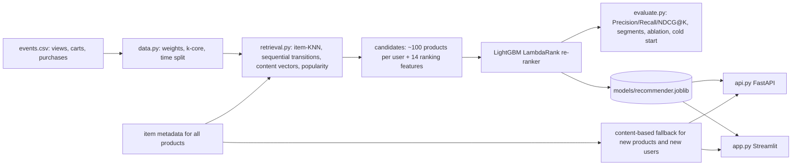
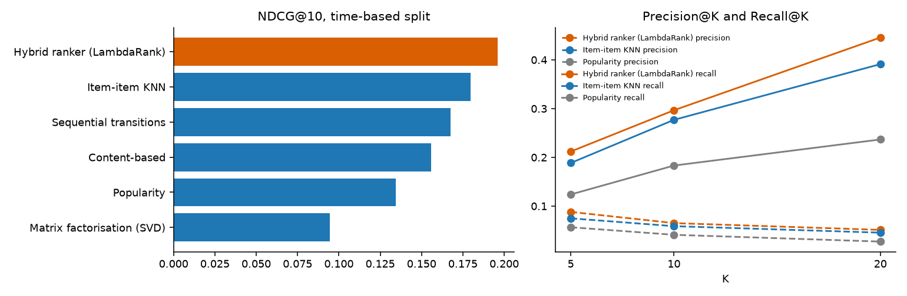
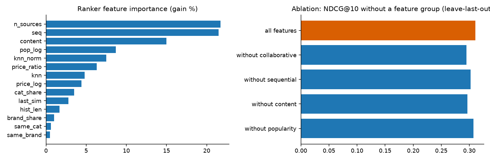
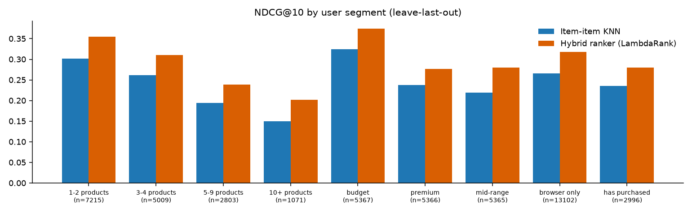

# Personalized Product Recommendation

[](https://github.com/ayushchaudharyx777-cmyk/product-recommender/actions/workflows/ci.yml)

**Live demo:** https://recommender-ayush.streamlit.app | **Results:** [`reports/RESULTS.md`](reports/RESULTS.md) | **API docs:** `/docs`

Recommend products to users of an electronics store from their views, carts and purchases. Candidates are
retrieved from four sources (collaborative, sequential, content, popularity) and re-ranked by a LightGBM
learning-to-rank model. Users and products with too little history get a **content-based fallback** built from
category, brand and price, so the system can answer for every product in the catalogue.



## How each step of the brief is done

| Step in the brief | What this project does | Where |
|---|---|---|
| 1. User-item interaction data from views, carts, purchases | Events weighted view = 1, cart = 3, purchase = 5, summed per user-product pair, capped and log-scaled; iterative k-core filter (users with 3+ products, products with 5+ users) | `src/data.py` |
| 2. Popularity baseline | Most popular products the user has not seen; every other model is compared against it | `src/evaluate.py` |
| 3. Collaborative filtering or matrix factorization | Item-item cosine KNN and truncated-SVD matrix factorization, plus a sequential "what is opened next" model | `src/retrieval.py`, `src/evaluate.py` |
| 4. Item metadata, content-based fallback for new products | Content vectors from category path, brand and price decile for **every** catalogue product. Used as a retrieval source, as ranking features, and as the fallback when a product or user is outside the collaborative model. Evaluated separately on cold users | `src/retrieval.py`, `src/recommend.py` |
| 5. Precision@K, Recall@K, NDCG@K with a time-based split | K = 5, 10, 20 for six models. Everything before the cut-off date is training data, the test is the new products each returning user touches after it; the ranker is trained on next-product labels from before the cut-off only | `src/train.py`, `src/metrics.py` |
| 6. Recommendation API and user-segment analysis | FastAPI service (user, session, similar-product endpoints). Results broken down by history length, shopper type, price tier and favourite category (on the larger leave-last-out split) | `api.py`, `reports/segments.csv` |

## Beyond the brief

| Area | What | Where |
|---|---|---|
| ML | **Retrieve-and-rank**: four candidate sources re-ranked by LambdaRank on collaborative, sequential, content and popularity features | `src/retrieval.py`, `src/evaluate.py` |
| ML | **Session recommendations**: recommend from any list of viewed products, so new visitors get personalised results | `Recommender.for_session` |
| ML | **Explanations**: each recommendation carries a reason built from the ranker's per-feature contributions ("often opened right after ...", "matches your interest in ...") | `src/recommend.py` |
| Evaluation | Two protocols (time-based and leave-last-out), paired bootstrap interval for ranker vs KNN, feature-group **ablation**, candidate-recall ceiling | `reports/RESULTS.md` |
| Evaluation | **Beyond accuracy**: catalogue coverage, category diversity, novelty | `src/metrics.py` |
| Engineering | Tests on synthetic data (metrics checked by hand, no-leak split, pipeline, serving, API), ruff, GitHub Actions CI, Dockerfile | `tests/`, `.github/` |

## Results

Full tables, segments and beyond-accuracy metrics: [`reports/RESULTS.md`](reports/RESULTS.md) (generated by the pipeline).

**Leave-last-out, 16,098 users** (predict each user's next product)

| Model | Precision@10 | Recall@10 | NDCG@10 |
|---|---|---|---|
| Popularity (baseline) | 0.0077 | 0.0771 | 0.0423 |
| Matrix factorization (SVD) | 0.0135 | 0.1346 | 0.0799 |
| Content-based | 0.0324 | 0.3239 | 0.1883 |
| Sequential transitions | 0.0437 | 0.4370 | 0.2607 |
| Item-item KNN | 0.0439 | 0.4392 | 0.2607 |
| **Hybrid ranker (LambdaRank)** | **0.0522** | **0.5219** | **0.3106** |

The ranker beats the best single model by +19% on NDCG@10 and Recall@10. The NDCG@10 gain over item-KNN is
+0.050 with a 95% bootstrap interval of +0.046 to +0.054. Stage 1 retrieves the hidden product for 84% of users,
which is the ceiling for the ranker.

**Time-based split, 317 returning users** (train before 2021-01-30, test on new products after it)

| Model | Precision@10 | Recall@10 | NDCG@10 |
|---|---|---|---|
| Matrix factorization (SVD) | 0.0341 | 0.1275 | 0.0945 |
| Popularity (baseline) | 0.0413 | 0.1834 | 0.1345 |
| Content-based | 0.0467 | 0.2321 | 0.1557 |
| Sequential transitions | 0.0574 | 0.2590 | 0.1674 |
| Item-item KNN | 0.0590 | 0.2772 | 0.1798 |
| **Hybrid ranker (LambdaRank)** | **0.0653** | **0.2969** | **0.1962** |

The ranker is again the best model on every metric (+9% NDCG@10 over item-KNN), but only 317 users return after
the cut-off, so the bootstrap interval for that gain (-0.006 to +0.037) includes zero. The direction agrees with
the large split; this small test set alone cannot confirm it.

**Cold start: content-based fallback**, 5,000 users outside the collaborative model, ranked against all 53,453
catalogue products (56% of the hidden products are not in the collaborative model at all)

| Model | Hit@10 | NDCG@10 |
|---|---|---|
| Popularity | 0.0334 | 0.0166 |
| **Content-based fallback** | **0.2858** | **0.1711** |

Metadata alone (category, brand, price) is 8.6x better than popularity for users the collaborative model cannot
serve.

**Ablation** (leave-last-out): retrain the ranker without one feature group

| Ranker | Recall@10 | NDCG@10 |
|---|---|---|
| All features | 0.5219 | 0.3106 |
| Without popularity | 0.5156 | 0.3073 |
| Without sequential | 0.5098 | 0.3021 |
| Without content | 0.4975 | 0.2965 |
| Without collaborative | 0.4996 | 0.2947 |

Every signal contributes; collaborative and content features matter most.





## Dataset

[eCommerce events history in electronics store](https://www.kaggle.com/datasets/mkechinov/ecommerce-events-history-in-electronics-store)
(Kaggle, REES46): about 885k events, 407k users and 53k products over five months. `category_code` is missing in
27% of rows and `brand` in 24%. Download `events.csv` to `data/events.csv` (not committed).

## Quick start

```cmd
python -m venv venv
venv\Scripts\activate
pip install -r requirements-dev.txt

python src\train.py                 :: full pipeline: evaluation, reports, serving model
streamlit run app.py                :: dashboard
uvicorn api:app --reload            :: API, docs at http://localhost:8000/docs
python -m pytest -q                 :: tests (synthetic data, no Kaggle file needed)
```

No Kaggle access? `python scripts\make_synthetic_data.py data\events.csv` writes a **synthetic** log for testing.
Never report numbers from it.

## API

```bash
curl localhost:8000/recommend/user/1515915625353230683?k=5
curl -X POST localhost:8000/recommend/session -H "Content-Type: application/json" \
     -d '{"product_ids": [1821813, 4099645], "k": 5}'
curl localhost:8000/similar/1821813
```

Every item in a response has `product_id`, `category_code`, `brand`, `price`, `score`, `source` (hybrid ranker,
content fallback or popularity) and `why`.

## How the evaluation avoids leakage

- **Time-based split.** One cut-off date. The ranker is trained to predict each user's last product before the
  cut-off from the products before that, with retrieval models fitted without those label interactions. For
  testing, retrieval is refitted on everything before the cut-off and scored on products each user first touches
  after it.
- **Leave-last-out.** The ranker is trained to predict each user's second-last product and tested on the last.
- A test checks that no (user, product) test label appears in the training history.

## Limitations

- Collaborative models cover only users with 3+ products and products with 5+ users. Everyone else relies on the
  content fallback, which is much weaker than collaborative filtering.
- The time-based test set contains only users who return after the cut-off, a small and more active group.
- The ranker cannot recommend a product that stage 1 did not retrieve; candidate recall is its ceiling.
- Explanations describe what drove the model's score. They are not causal.
- Offline metrics only. No online or A/B test.

## Future scope

- Two-tower or ALS embeddings with approximate nearest-neighbour search to raise candidate recall
- Session-based sequence models (GRU4Rec, SASRec)
- Learned text embeddings of product titles for a stronger content fallback
- Re-ranking for diversity and business rules (stock, margin)
- Online A/B testing and drift monitoring of recommendation coverage
